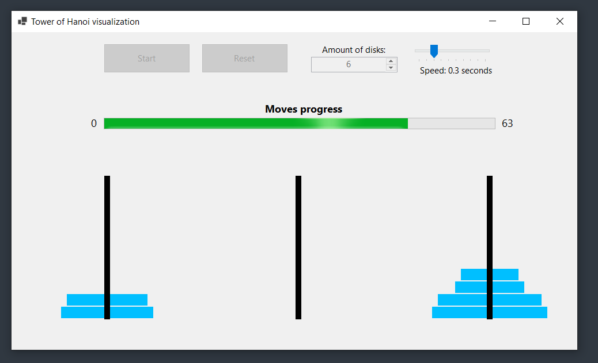
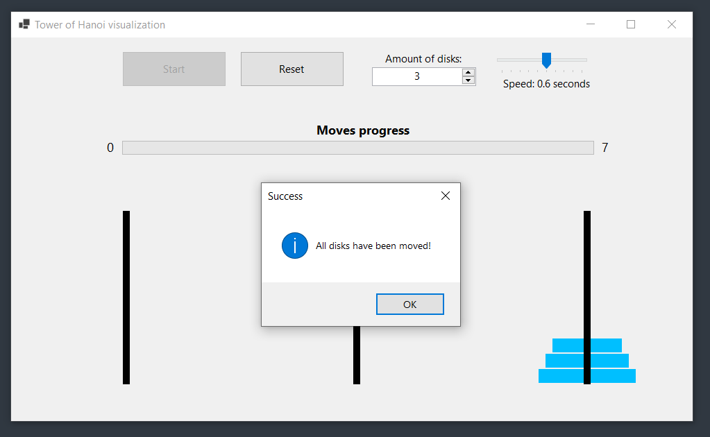

<br>

<h1 align="center">
  TowerOfHanoi
</h1>

---

The goal of this project is to give an inside on how the _"Tower of Hanoi"_ problem can be solved.
Additionally it gives a good visualization on how the algorithm works.

---

## Features

- **NumericUpDown** control to determine the amount of disks used for the solve process.
- **ProgressBar** which displays the current progress of the solve process.
- **TrackBar** to set and change the speed of the visualization.
- **Start** and **Reset** buttons to begin or restart the simulation.

## How it Works

The _"Tower of Hanoi"_ is a problem where you move a set of disks from one rod to another with some specific rules:
- Only one disk can be moved at a time.
- Bigger disks can not be placed on smaller disks.
- Disks must be moved between the three rods (source, auxiliary, destination).

The visualization runs the recursive algorithm to solve the problem and visually moves the disks between the pegs on the form.

## Controls

- **Disk Count**: Set the number of disks for the Tower of Hanoi using the `NumericUpDown` control.
- **Timer Interval**: Use the `TrackBar` to set the speed of the visualization.
- **Start Button**: Begins the _"Tower of Hanoi"_ simulation.
- **Reset Button**: Resets the visualization and the algorithm, allowing you to change settings or start over.

## How to Run

1. Clone this repository:
   ```bash git clone https://github.com/mLoDar/TowerOfHanoi.git```

2. Open the solution file `(.sln)` in Visual Studio.

3. Build the project and run it.

## Screenshots

<p align="center">
    
    <br>
    
</p>

## Future Improvements

- [ ] Add step-by-step mode, allowing users to control each move manually.
- [ ] Include a pause and resume button for better control over the simulation.
- [ ] Add more customization options for colors and peg design.
   
---

<p align="center">
    <i>
        Feel free to submit pull requests or issues!
    </i>
</p>